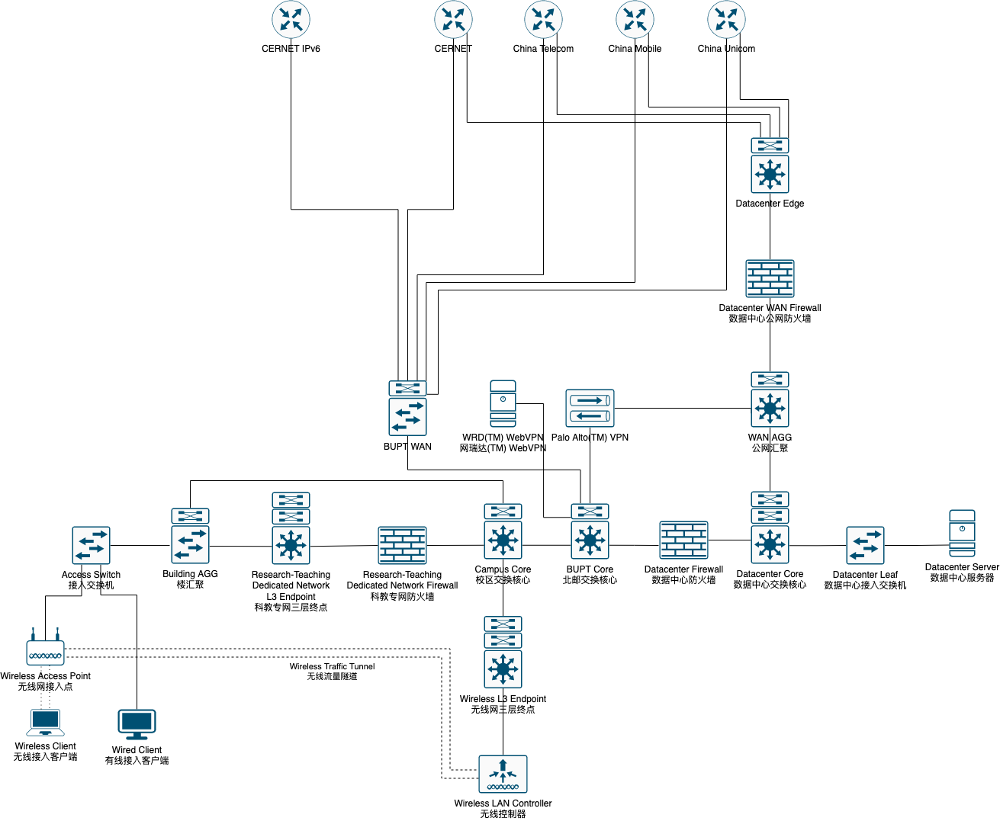

# 北京邮电大学校园网接入服务使用说明

## 主旨

本项目旨在方便用户理解现行北京邮电大学校园网架构，提供接入、认证、排障帮助。
本文档将介绍一部分部署时用到的技术方案及规范，供需参考。
欢迎用户进行补充、更正。

## 目录

- VPN
  - [校园网 VPN](./VPN/vpn-bupt-edu-cn.md)
  - [图书馆资源 VPN](./VPN/libvpn-bupt-edu-cn.md)
  - [WRD(TM) 校园网 WEBVPN](./VPN/webvpn-bupt-edu-cn.md)
  - [WRD(TM) 图书馆资源 WEBVPN](./VPN/libcon-bupt-edu-cn.md)
- 有线网接入
  - 西土城校区
    - [科教专网](./Wired/10-112.md)
    - [宿舍区](./Wired/XTC-dormitory-wired.md)
    - [办公部门/实验室专网](./Wired/XTC-office-wired.md)
    - [教学专网（教室多媒体）](./Wired/XTC-teaching-wired.md)
- 无线网接入
  - 西土城校区
    - [BUPT-mobile](./Wireless/XTC-BUPT-mobile.md)
    - [BUPT-portal](./Wireless/XTC-BUPT-portal.md)
    - [BUPT-guest](./Wireless/XTC-BUPT-guest.md)
    - [eduroam](./Wireless/XTC-eduroam.md)
- [初始化/更改账户凭证](./netaccount-bupt-edu-cn.md)
- [报修/人工支持工单提交](./3039-bupt-edu-cn.md)

## 简要拓扑

