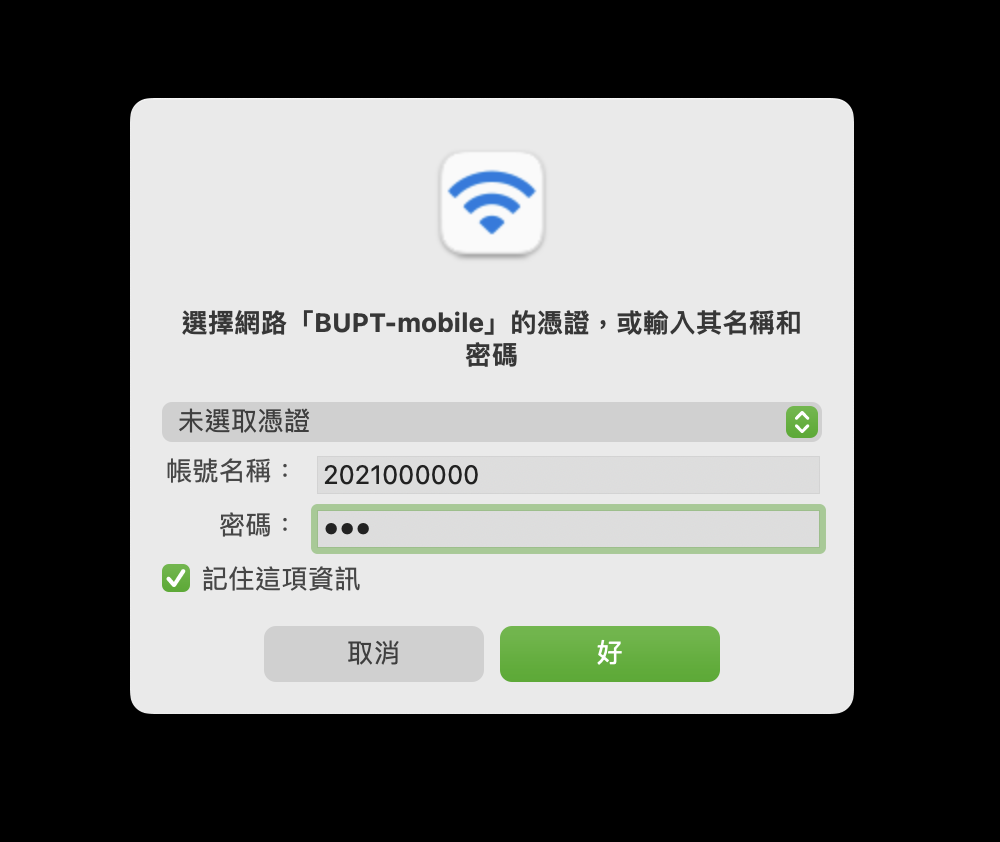

# 西土城校区 BUPT-mobile

ESSID: BUPT-mobile
## 简介

本 ESSID 主要提供支持 WPA2-Enterprise 安全标准的无线终端接入，用户通过 EAP 认证后，即可利用本接入服务满足下行上网需求。
## 接入方法

### 简介

1. 信任证书"BUPT Local Server Certificate"
   - [PEM 在这里](./XTC-BUPT-mobile-assets/BUPT-Local-Server-Certificate.crt)
2. 键入用户名（学工号）及凭证
3. 接入
### Android

#### 简介

1. 下载证书"BUPT Local Server Certificate"。
2. 在“设置”-“安全”-“高级”（或称“更多安全设置”）-“加密与凭据”-“安装证书”（或称“从存储设备安装”）-“WLAN 证书”安装步骤 1 中下载的证书，“为此证书命名”可以填写“BUPT Local Server Certificate”。
3. 在“设置”-“网络和互联网”-“WLAN”-连接 "BUPT-mobile"-“CA 证书”-选择步骤 2 中安装的“BUPT Local Server Certificate”；在“阶段 2 验证”选择“MSCHAPV2”；在“域名”填写“BUPT Local Server Certificate”；在“身份”输入学工号；“密码”为校园网账号密码。
4. 点击“连接”。

#### 逐步指引

1. 下载证书"BUPT Local Server Certificate"。

2. 在“设置”-“安全”-“高级”（或称“更多安全设置”）-“加密与凭据”-“安装证书”（或称“从存储设备安装”）-“WLAN 证书”安装步骤 1 中下载的证书，“为此证书命名”可以填写“BUPT Local Server Certificate”。
    

3. 在“设置”-“网络和互联网”-“WLAN”-连接 "BUPT-mobile"-“CA 证书”-选择步骤 2 中安装的“BUPT Local Server Certificate”；在“阶段 2 验证”选择“MSCHAPV2”；在“域名”填写“BUPT Local Server Certificate”；在“身份”输入学工号；“密码”为校园网账号密码。
    

4. 点击“连接”。
### iOS

TBD
### Windows 10

TBD

### macOS

### 简介

1. 在"系统偏好设定"-"网路"-"网路名称"选择 ESSID "BUPT-mobile"
2. 在"选择网路[BUPT-mobile]的凭证，或输入其名称和密码"界面输入账号名称及密码
3. 在"验证凭证"界面验证此次连接利用的 TLS 证书确实为"BUPT Local Server Certificate"，并点击"继续"
4. 此刻应已接入 ESSID "BUPT-mobile" 的无线局域网

### 逐步指引

1. 在"系统偏好设定"-"网路"-"网路名称"选择 ESSID "BUPT-mobile"
    

2. 在"选择网路[BUPT-mobile]的凭证，或输入其名称和密码"界面输入账号名称及密码
    
3. 在"验证凭证"界面验证此次连接利用的 TLS 证书确实为"BUPT Local Server Certificate"，并点击"继续"
    

4. 此刻应已接入 ESSID "BUPT-mobile" 的无线局域网
### FAQ

- 在接入成功后 IPv6 RA 已分配到地址，但 IPv4 DHCP 并未分配地址。
  - 此处尝试关闭无线网接口、再开启无线网接口；
  - 若未恢复，可能为 Wireless Controller 或 Wireless L3 Endpoint 策略配置有误，或 DHCP Server 故障导致，此时应报修，请参照[报修/人工支持工单提交](../3039-bupt-edu-cn.md)。

## 技术方案

TBD

## 拓扑关系

