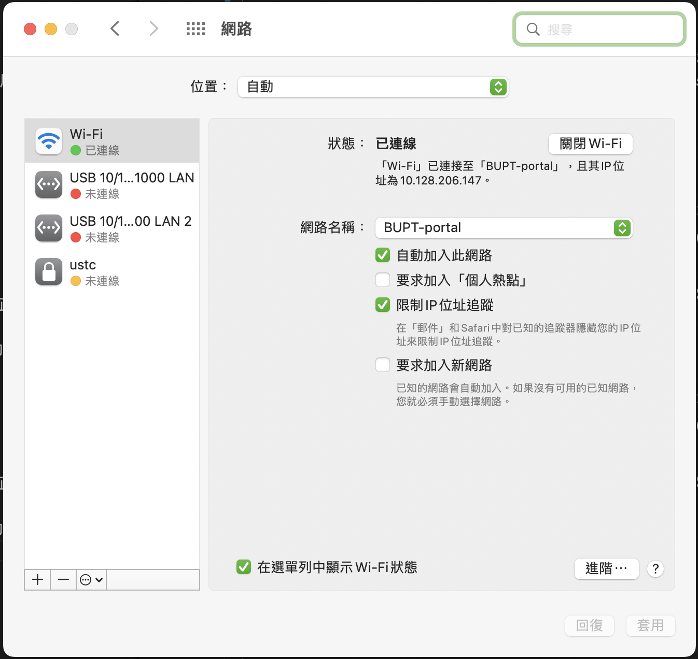
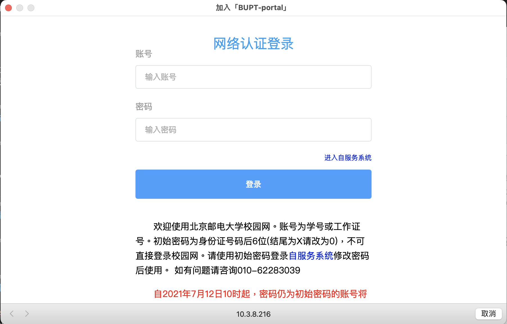
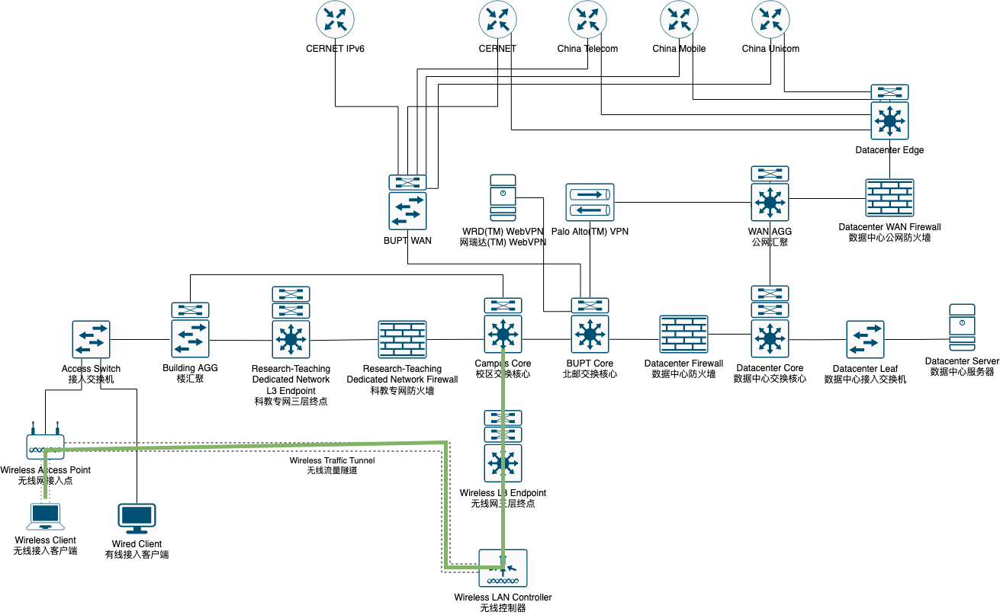

# 西土城校区 BUPT-portal

ESSID: BUPT-portal

## 简介

本 ESSID 主要提供利用 Captive Portal 进行准入鉴权的无线接入服务，用户在 Captive Portal 页通过鉴权后，即可利用本接入服务满足下行上网需求。

## 接入方法

### 简介

1. 选择接入 ESSID 为 "BUPT-portal" 的无线局域网
2. 在操作系统 check connectivity 之后弹出的 Captive Portal 认证页键入用户名密码，点击登录
   - 若此步中，操作系统未能检查 Captive Portal 状态，则用户应浏览器访问任意 plain HTTP 站点；若正常访问，证明已通过认证；若被重定向到认证页，则应在此页面键入用户名密码，点击登录
3. 若提示您已登入成功，则此刻已成功接入 ESSID 为 "BUPT-portal" 的无线局域网，以满足下行上网需求
### 逐步指引

1. 选择接入 ESSID 为 "BUPT-portal" 的无线局域网
    

2. 在操作系统 check connectivity 之后弹出的 Captive Portal 认证页键入用户名密码，点击登录
    - 若此步中，操作系统未能检查 Captive Portal 状态，则用户应浏览器访问任意 plain HTTP 站点；若正常访问，证明已通过认证；若被重定向到认证页，则应在此页面键入用户名密码，点击登录
    - 常见的 plain HTTP 站点选择如下：
        - http://connectivitycheck.gstatic.com/generate_204
        - http://captive.apple.com/generate_204
        - http://www.msftconnecttest.com/connecttest.txt
    

3. 若提示您已登入成功，则此刻已成功接入 ESSID 为 "BUPT-portal" 的无线局域网，以满足下行上网需求
## FAQ

- 如若用户自行访问 Captive Portal 认证页，而非由 AC 重定向，将会缺少必要参数，当 ClearPass 缓存过期时，认证页将会提示用户"认证失败 0x01000003"。
  - 此刻，用户应按照本文档"简介"-"2"指示操作，令 AC 携带参数重定向到认证页
## 技术方案

- [Wikipedia - Captive Portal](https://en.wikipedia.org/wiki/Captive_portal)
- [Aruba. ARUBA CAMPUS FOR LARGE NETWORKS Design & Deployment Guide](https://www.arubanetworks.com/assets/tg/AVD_Large-Campus-Design-Deploy.pdf)
  - DHCP Snooping + RA Guard
  - ARP 代答
  - Deny inter-user bridging
## 拓扑关系

用户流量到校区交换核心路径如图中绿色标注所示。

